# 下载并安装哔哩的详细说明

本文将详细讲述 `哔哩` 的侧加载安装过程，请按照下文所述一步步操作，在安装中遇到的问题，可以在 [哔哩论坛](https://github.com/Richasy/Bili.Uwp/discussions) 中讨论。

## 准备

首先，你需要打开系统的开发者模式，这是通过侧加载方式安装 UWP 应用的前置条件，否则，您的设备只能安装来自 Microsoft Store 的 UWP 应用。

点击 [链接](ms-settings:developers) 打开系统设置的 `开发者选项`，如果浏览器无法打开，请参考以下步骤进入 `开发者选项` 页面.

1. 进入 `设置`。
2. 打开 `隐私和安全性` 页面。
3. 选择 `开发者选项` 选项。

进入后打开 `开发者模式`，等待系统安装一些必要组件。

## 下载应用

1. 进入 Github 的 [Release](https://github.com/Richasy/Bili.Uwp/releases) 页面。

    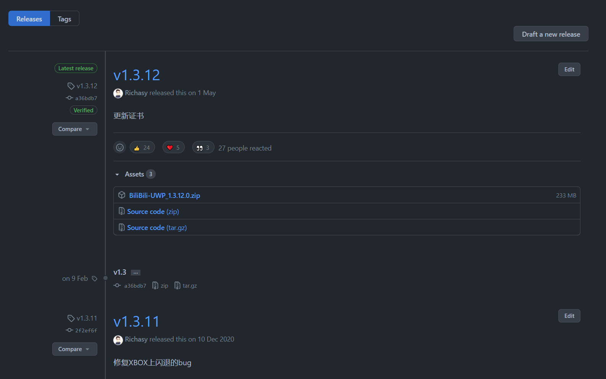

2. 找到标识 `Latest release` 标识的版本，该版本意味着最新发布版本。在该版本中下的 `Assets` 面板中找到适合自己设备平台的包并点击下载。具体平台版本对应如下：

    |架构|说明|示例包名|
    |-|-|-|
    |x64|64 位平台，是现在的主流平台 在设置的 [关于](ms-settings:about) 页面中的 `设备规格` 区块可以查看当前的系统类型|Bili.Uwp_{版本号}_x64.zip|
    |x86|32 位平台，确认方法可以参照 x64 进行|Bili.Uwp_{版本号}_x86.zip|
    |ARM64|64 位 ARM 架构，Surface Pro X 是典型设备|Bili.Uwp_{版本号}_ARM64.zip|

    *注：ARM 架构在 UWP 中通常指 Windows Phone 设备，目前已不再支持。*

## 推荐：使用 PowerShell 安装应用

优势：通过脚本安装，可以自动安装证书，方便快捷。

1. 解压上一步骤下载的应用压缩包。
2. 在解压后的文件夹中找到 `install.ps1` 这个脚本文件。
3. 右键单击该文件，并选择 `使用 PowerShell 运行`。
    
    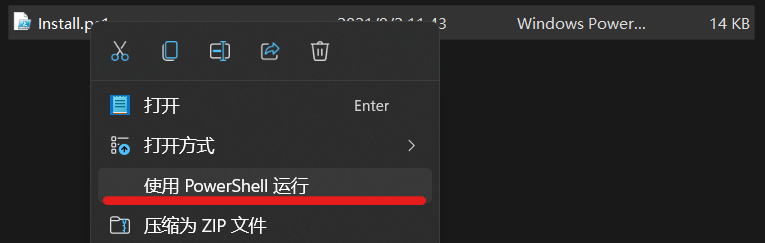

4. 在初次运行时，安装脚本会在安装证书时提示你提升权限，请按 `回车 (Enter)` 键继续。
    
    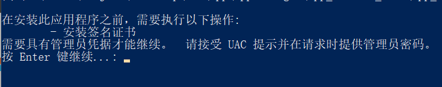

5. 在安装证书时，请输入 `Y` 以继续

    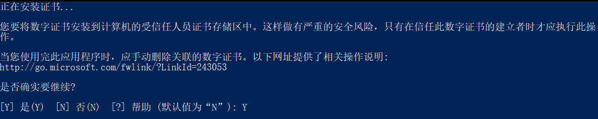

6. 等待安装完成

    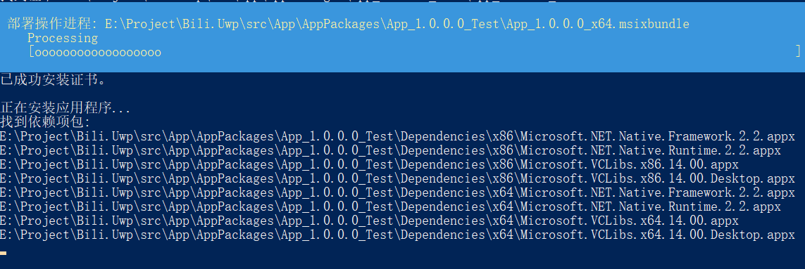

7. 现在你可以在你的开始菜单中找到 `哔哩` 了。

## 常规：使用应用安装程序 (App Installer)

优势：图形化操作界面，易于理解

劣势：需要手动安装证书

1. （可选）在 Microsoft Store 中下载或更新 [应用安装程序](ms-windows-store://pdp/?productId=9NBLGGH4NNS1)。
2. 解压之前下载的应用压缩包。
3. 在解压后的文件夹中找到后缀名为 `.cer` 的证书文件。

    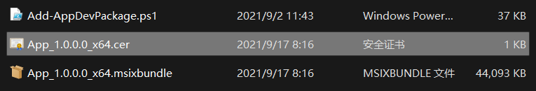

4. 双击运行，点击 `安装证书`。

    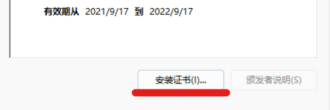

5. 存储位置选择 `本地计算机`，点击 `下一页`，并通过 UAC 验证

    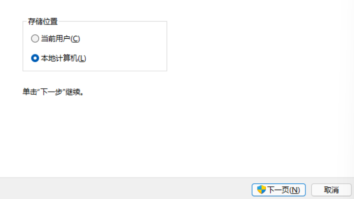

6. 选择 `将所有的证书都放入下列存储`，并点击 `浏览`，选择 `受信任的根证书颁发机构`，点击 `确定`，再点击 `下一页`。

    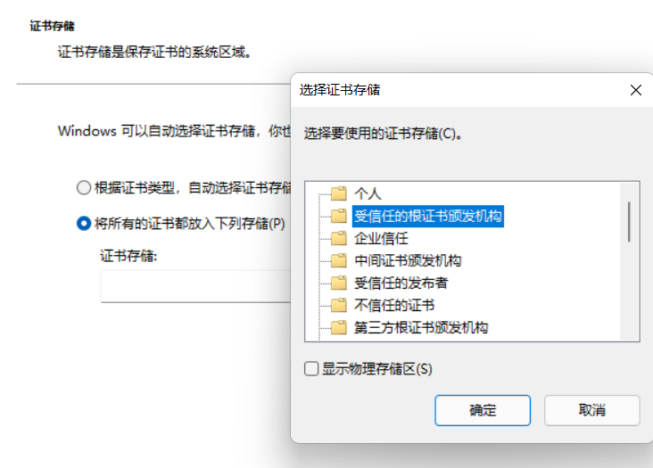

7. 证书已导入，点击 `完成` 即可结束证书导入。
8. 在解压的应用包文件夹中，双击打开后缀名为 `.msixbundle` 的安装包。

    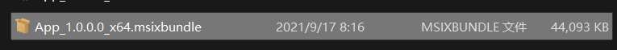

9. 到了这一步就简单了，确认安装包显示的是 `Trusted App`，这表示我们的证书导入正确，点击 `Install` 按钮，等待应用安装完成即可。

    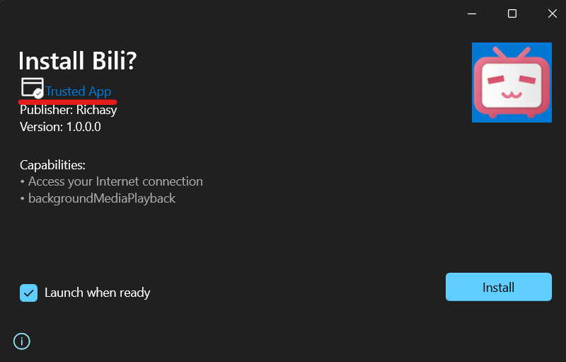

## 订阅更新

为了能在 `哔哩` 更新时收到通知，请在 Github 的 `哔哩` 仓库中，点击右上角的 `Watch` 以进行追踪，详细步骤如下：

1. 点击 `Watch` 按钮，再点击旁边的三角符号。

    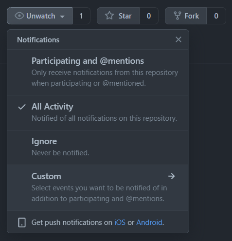

2. 选择 `Custom`，选中 `Release`，并点击 `Apply`。

    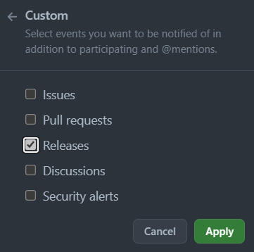

这样，在之后 `哔哩` 的 `Release` 页面更新时，你就能在你的注册邮箱中收到订阅邮件，从而获知最新的版本。

有条件的小伙伴也可以下载 Github 的 Android 或 iOS 客户端，能得到更直接的通知推送。